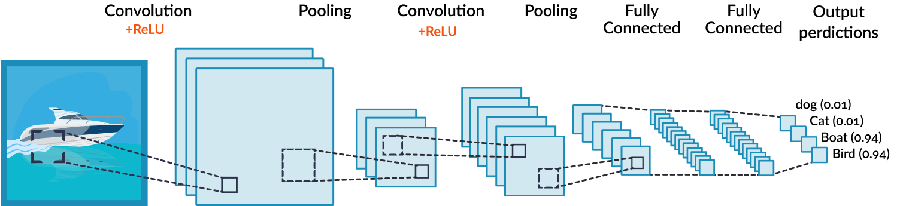

# Continual Learning
  
## Table of Contents  
- [About the Project](#1) 
  - [Built With](#2)
  - [Structure](#3)
  - [Neural Network](#4)
  - [Dataset](#5)
- [Usage](#6)  

# About the Project <a name="1"/>
Humans and animals have the ability to acquire, to perfect and continuously modify their knowledge and skills throughout the duration
of their life. This ability, called Continual Learning, is composed from a rich set of neurocognitive mechanisms that together contribute
to the development and specialization of our sensorimotor skills, as well as to the strengthening and recovery of long-term memory.

Consequently, the application of Continual Learning to computational systems and agents autonomous that interact in the real world and process continuous flows of
information can be of paramount importance.

However, the Continual Learning remains a long-standing challenge for machine learning and models of Neural Network since the continuous acquisition of information available in incrementally from unstable data distributions generally leads to obtain the Catastrophic Forgetting.

## Built With <a name="2"/>
- [Pytorch](https://pytorch.org/): An open source machine learning framework that accelerates the path from research prototyping to production deployment.
- [Numpy](https://numpy.org/)

## Structure <a name="3"/>
In this thesis the Continual Learning concept showing its strengths and difficulties (Catastrophic Forgetting) via a Visual Recognition problem.

To do this, a framework was implemented that was able to execute a Pipeline, who will have the task of carrying out the learning carried out by a model for the
Continual Learning showing the need for forgetting. Before showing the results obtained will be described the concepts at a theoretical level and presented
the tools used during the Pipeline.

The work described is divided into three parts: the first relating to the Joint-Training and the last two to Task Agnostic / Task Aware configurations. Subsequently, a very naïve solution inspired by the paper will be presented.

## Neural Network <a name="4"/>
  

The Convolutional Neural Network (CNN or ConvNet) is a class of deep neural networks, very often applied to image analysis and recognition.

The Convolutional Neural Network used in this project consists of six Conv2D layers separated by two MaxPool2D and finally by two Fully Connected Layers on which I applied Dropout to limit overfitting during training.

The peculiarity of this network is that the output layer is Dynamic, that is, it changes depending on the number of tasks on which you want to work and on the type of approach chosen between Task-Agnostic and Task-Aware.

## Dataset <a name="5"/>
  

The dataset used in this report is CIFAR-10. It is made up
from 60,000 color images (they will have 3 channels for each image to manage RGB) 32x32 divided into 10 classes, with 6000 images per class. There are 50,000 training images and 10,000 test images available.

The dataset is divided into five training batches and a testing batch, each with 10,000 images. The test batch contains exactly 1000 images randomly selected from each class.
# Usage <a name="6"/>
If interested in the code, just download the .ipynb file present in the repo. With this solution it is not necessary to download the various libraries present within the code.
# Authors
- [**Lorenzo Gianassi**](https://github.com/LorenzoGianassi)
# Acknowledgments
Thesis project for the Computer Engineering Degree with supervisor Professor [Andrew David Bagdanov](https://www.unifi.it/p-doc2-2015-0-A-2c303b2d3530-1.html) - Computer Engineering Degree @[University of Florence](https://www.unifi.it/changelang-eng.html)
